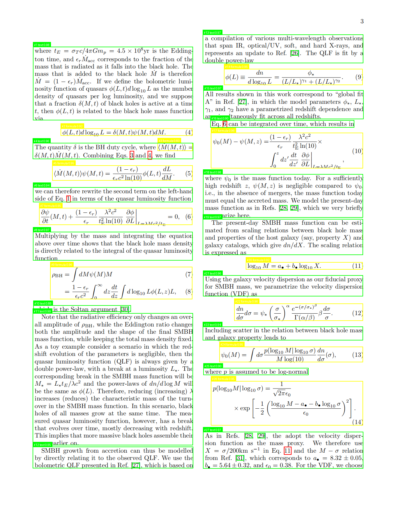

# x-pdf2md

一个将PDF文档转换为Markdown的高级工具包，支持自动提取文本、识别公式、表格和图像。

## 功能特点

- PDF文档页面转换为图像
- 基于深度学习的版面分析
- 数学公式识别并转换为LaTeX格式
- 表格提取并转换为Markdown格式
- 图像自动描述并上传
- 多栏文本智能识别与排版

## 安装

### 1. 安装特殊依赖

本项目依赖于PaddlePaddle和PaddleX进行深度学习模型推理，这些依赖需要单独安装：

#### CPU版本

```bash
# 首先安装PaddlePaddle CPU版本
pip install paddlepaddle==3.0.0rc0 -i https://www.paddlepaddle.org.cn/packages/stable/cpu/

# 然后安装PaddleX
pip install https://paddle-model-ecology.bj.bcebos.com/paddlex/whl/paddlex-3.0.0rc0-py3-none-any.whl
```

#### GPU版本（CUDA 11.8）

```bash
# 安装PaddlePaddle GPU版本
pip install paddlepaddle-gpu==3.0.0rc0 -i https://www.paddlepaddle.org.cn/packages/stable/cu118/

# 然后安装PaddleX
pip install https://paddle-model-ecology.bj.bcebos.com/paddlex/whl/paddlex-3.0.0rc0-py3-none-any.whl
```

#### 其他CUDA版本

如果需要支持其他CUDA版本，请参考[PaddlePaddle官方安装指南](https://www.paddlepaddle.org.cn/install/quick)选择合适的安装命令。

### 2. 安装项目本身

```bash
# 克隆项目
git clone https://github.com/li-xiu-qi/x-pdf2md.git
cd x-pdf2md

# 安装项目及其依赖
pip install .
```

或者直接使用pip安装：

```bash
# 从本地目录安装
pip install -e .

# 或从GitHub安装
pip install git+https://github.com/li-xiu-qi/x-pdf2md.git
```

## 使用方法

### 作为命令行工具

从命令行转换PDF文件：

```bash
# 基本用法
x-pdf2md -p input.pdf -o output_dir --output-md result.md

# 使用更多选项
x-pdf2md -p input.pdf -o output_dir -s 0 -e 5 -d 300 --threshold_lr 0.9 --threshold_cross 0.3 --upload --output-md result.md
```

### 作为Python包导入

#### 快速转换方法

```python
from x_pdf2md.main import convert_pdf_to_markdown

# 转换并获取Markdown内容列表
md_content_list = convert_pdf_to_markdown(
    pdf_path="input.pdf",
    output_dir="output",
    start_page=0,
    end_page=5,
    dpi=300
)

# 或直接保存为文件
output_path = convert_pdf_to_markdown(
    pdf_path="input.pdf",
    output_dir="output",
    upload_images=True,  # 启用图片上传
    output_md_path="result.md"
)
```

#### 分步处理方法

```python
from x_pdf2md.process_pdf import process_pdf_document
from x_pdf2md.format_res import format_pdf_regions
from x_pdf2md.remote_image import default_uploader

# 处理PDF文档
regions = process_pdf_document(
    pdf_path="input.pdf",
    output_dir="output",
    start_page=0,
    end_page=None,
    dpi=300
)

# 格式化为Markdown（选择性启用图片上传）
formatted_pages = format_pdf_regions(regions, default_uploader)

# 保存结果
with open("output.md", "w", encoding="utf-8") as f:
    f.write("\n\n---\n\n".join(formatted_pages))
```

### 高级功能用法

#### 公式识别与转换

```python
from x_pdf2md.image_utils.formula_recognize import recognize_formula

# 识别公式图像
formula_latex = recognize_formula("path/to/formula_image.png")
print(f"识别的公式: {formula_latex}")
```

#### 文本与表格提取

```python
from x_pdf2md.image2md.vlm_function import extract_text_from_image, extract_table_from_image

# 提取文本内容
text = extract_text_from_image("path/to/text_image.png")
print(f"提取的文本: {text}")

# 提取表格并转换为Markdown
table_md = extract_table_from_image("path/to/table_image.png")
print(f"提取的表格: {table_md}")
```

#### 图片上传服务

启动本地图片上传服务器：

```bash
# 进入项目目录
cd x_pdf2md/remote_image

# 启动服务
python image_serve.py
```

服务启动后，访问 http://localhost:8100 可以使用Web界面上传和管理图片。

## 参数说明

### 命令行参数

- `-p`, `--pdf`: 输入PDF文件路径（必填）
- `-o`, `--output`: 输出目录路径，默认为"output"
- `-s`, `--start_page`: 起始页码（从0开始），默认为0
- `-e`, `--end_page`: 结束页码，默认为处理全部页面
- `-d`, `--dpi`: 图像分辨率，默认为300
- `--threshold_lr`: 左右栏阈值，默认为0.9
- `--threshold_cross`: 跨栏阈值，默认为0.3
- `--no-filter`: 不过滤区域
- `--upload`: 启用图片上传
- `--output-md`: Markdown输出文件路径，默认为"output.md"

### 配置文件

在项目根目录创建`.env`文件可配置环境变量：

```
API_KEY=your_api_key
BASE_URL=https://api.example.com/v1
HOST=0.0.0.0
PORT=8100
UPLOAD_DIR=./uploads
```

## 配置方式

### 环境变量配置

x-pdf2md支持通过环境变量或`.env`文件配置。创建`.env`文件在项目根目录：

## 项目结构

```
x-pdf2md/
├── x_pdf2md/                   # 主包目录
│   ├── __init__.py             # 包初始化文件
│   ├── main.py                 # 命令行入口点
│   ├── process_pdf.py          # PDF处理核心功能
│   ├── format_res.py           # 结果格式化
│   ├── image_utils/            # 图像处理工具
│   │   ├── formula_recognize.py  # 公式识别
│   │   ├── process_page.py     # 页面处理
│   │   ├── region_image.py     # 区域图像类
│   │   └── layout_config.py    # 布局配置
│   ├── image2md/               # 图像转MD工具
│   ├── ocr_utils/              # OCR工具
│   ├── pdf_utils/              # PDF工具
│   ├── remote_image/           # 远程图像工具
│   └── tests/                  # 测试目录
├── setup.py                    # 安装脚本
├── requirements.txt            # 依赖要求（CPU版）
├── requirements-gpu.txt        # 依赖要求（GPU版）
└── README.md                   # 项目说明
```

## 依赖要求

### 基本依赖
- Python >= 3.7
- tqdm >= 4.45.0
- pdf2image >= 1.14.0
- Pillow >= 8.0.0
- numpy >= 1.18.0
- opencv-python >= 4.5.0
- pytesseract >= 0.3.0
- requests >= 2.25.0
- fastapi
- pymupdf
- python-dotenv
- uvicorn

### 特殊依赖
- paddlepaddle == 3.0.0rc0
- paddlex == 3.0.0rc0

## 模型下载

PaddleX模型需要单独下载，程序首次运行时会自动下载相关模型。若要手动下载模型，可访问：
- 公式识别模型：[PP-FormulaNet](https://github.com/PaddlePaddle/PaddleClas/blob/release/2.5/docs/zh_CN/models/PP-FormulaNet.md)
- 版面分析模型：[PP-StructureV2](https://github.com/PaddlePaddle/PaddleOCR/blob/release/2.6/ppstructure/README_ch.md)

## 开发指南

### 安装开发依赖

```bash
# 安装开发依赖
pip install -r requirements.txt

# 安装pre-commit钩子
pre-commit install
```

### 代码风格

项目使用Black和isort进行代码格式化，使用flake8进行代码质量检查。

## 常见问题

**Q: 安装PaddlePaddle时出现错误怎么办？**

A: 请确保您的Python版本兼容（建议使用Python 3.7-3.9），并参考[PaddlePaddle安装问题排查](https://www.paddlepaddle.org.cn/documentation/docs/zh/install/index_cn.html)。

**Q: 模型下载很慢或失败怎么办？**

A: 您可以手动下载模型并放置在对应目录中，参考模型下载部分的链接获取详细说明。

**Q: 运行`x-pdf2md`命令时提示"不是内部或外部命令"怎么办？**

A: 这通常意味着命令行工具没有正确安装或没有添加到系统PATH中。请尝试以下解决方法：

1. 确保已经正确安装了包：
   ```bash
   pip install -e .
   ```

2. 安装后确认入口点是否已创建（在Python的Scripts目录中查找x-pdf2md.exe）：
   ```bash
   pip show x-pdf2md
   # 查看installed-files.txt中是否有Scripts/x-pdf2md.exe
   ```

3. 如果仍然无法运行，可以尝试通过Python模块方式运行：
   ```bash
   python -m x_pdf2md.main -p input.pdf -o output_dir
   ```

4. 或者直接运行main.py：
   ```bash
   python x_pdf2md/main.py -p input.pdf -o output_dir
   ```

5. 检查setup.py中的entry_points配置是否正确：
   ```python
   entry_points={
       'console_scripts': [
           'x-pdf2md=x_pdf2md.main:main',
       ],
   }
   ```

## 开源协议

本项目使用 [BSD 开源协议](./LICENSE)。
